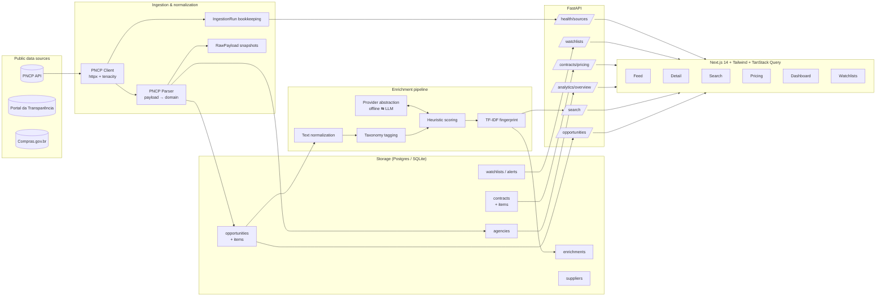

<p align="center">
  
</p>

<h1 align="center">LicitScope</h1>

<p align="center">
  <strong>AI procurement intelligence for Brazilian public procurement data.</strong><br/>
  <sub>PNCP · Portal da Transparência · Compras.gov.br · pricing signals · semantic search</sub>
</p>

<p align="center">
  
  
  
  
  
  
</p>

---

## ✨ What it does

**LicitScope** is a B2G / govtech intelligence platform focused on the
Brazilian public procurement ecosystem. It ingests real public procurement
data, normalizes it, enriches it with explainable AI heuristics, and exposes
a polished dashboard so that analysts can:

- 🔎 **Browse and filter** thousands of licitações, contracts, and atas
- 🧠 **Read AI-generated summaries** and extracted structured signals
- 📊 **Compare prices** across agencies and flag anomalous dispersion
- 🧭 **Search semantically** (TF-IDF, offline — no LLM needed)
- 🔔 **Save watchlists** and run alerting against custom filter expressions
- 🏛️ **Profile agencies and suppliers** with ratios and category mix
- 📡 **Monitor source freshness** via ingestion-run bookkeeping

It is designed to look and behave like a **serious govtech intelligence
product** — not a student CRUD app — while remaining lightweight enough to
run on a laptop with `docker compose up` or a single SQLite file.

> 🧪 The public repo runs on deterministic fixtures modelled after real PNCP
> shapes, so the demo is **always live and reproducible**. Switch a single
> env var to ingest from the real PNCP API.

---

## 🎯 Screens

> The screens below are a textual spec — see [`docs/SCREENSHOTS.md`](docs/SCREENSHOTS.md)
> for the exact pages to capture when producing demo assets.

```
 ┌──────────────────────────── Overview ────────────────────────────┐
 │  KPIs (7d notices / value / open-for-proposals / avg risk)       │
 │  Publications per day · Modality mix                             │
 │  Top categories · Geographic distribution · Top agencies         │
 │  Recent notices · Source health                                  │
 └───────────────────────────────────────────────────────────────────┘

 /opportunities           — feed with faceted filters & sort
 /opportunities/{id}      — detail with AI summary, bullets, signals
 /search                  — semantic TF-IDF search + shared keywords
 /contracts               — pricing intelligence + contract history
 /agencies, /suppliers    — profiles with KPIs and category mix
 /watchlists              — saved filters + alert runs
 /health                  — source freshness and ingestion logs
 /about                   — the story, fonts, IA, roadmap
```

---

## 🏗️ Architecture



Read the full breakdown in [`docs/ARCHITECTURE.md`](docs/ARCHITECTURE.md).

---

## 🧪 Tech stack

| Layer | Stack |
| --- | --- |
| Backend | FastAPI · SQLModel · Pydantic v2 · httpx · tenacity |
| Data | PostgreSQL 16 (prod) · SQLite (local/tests) · JSONB metadata |
| Enrichment | Offline heuristics · hashed TF-IDF similarity · provider abstraction |
| Frontend | Next.js 14 (app router) · TypeScript · Tailwind · TanStack Query · Recharts · lucide-react |
| DevOps | Docker Compose · GitHub Actions · ruff · pytest · ESLint · Dependabot |
| Tests | 49 backend tests covering parsing, scoring, API, watchlists, ingestion |

---

## 🚀 Quick start

### Docker (recommended)

```bash
git clone https://github.com/your-org/licitscope && cd licitscope
cp .env.example .env
make up       # postgres + api + web
# open http://localhost:3000  (web)   http://localhost:8000/docs  (api)
```

The API container auto-seeds the demo fixtures on first run.

### Local (SQLite, no Docker)

```bash
./scripts/dev-setup.sh        # creates venv, installs deps, seeds demo DB
make api &                    # http://localhost:8000
make web                      # http://localhost:3000
```

### Against the live PNCP API

```bash
cd apps/api
INGESTION_USE_FIXTURES=false DATABASE_URL="sqlite:///./licitscope.db" \
    python -m app.scripts.run_ingestion
```

Any failure gracefully falls back to bundled snapshots so the UI always has
something to render.

---

## 📚 Documentation

| Document | What it covers |
| --- | --- |
| [`docs/ARCHITECTURE.md`](docs/ARCHITECTURE.md) | Service layers, ingestion flow, separation of concerns |
| [`docs/DATA_MODEL.md`](docs/DATA_MODEL.md)     | Schema, ERD, constraints, indexes |
| [`docs/INGESTION.md`](docs/INGESTION.md)       | PNCP endpoints used, rate limits, retry strategy |
| [`docs/ENRICHMENT.md`](docs/ENRICHMENT.md)     | Offline heuristics, scoring rules, LLM integration points |
| [`docs/LOCAL_DEV.md`](docs/LOCAL_DEV.md)       | Full setup walkthrough, common tasks |
| [`docs/ROADMAP.md`](docs/ROADMAP.md)           | What is intentionally not built yet + the "next 90 days" shortlist |
| [`docs/ETHICS.md`](docs/ETHICS.md)             | Data provenance, responsible use, disclaimers |
| [`docs/SCREENSHOTS.md`](docs/SCREENSHOTS.md)   | Screens to capture for the portfolio walk-through |
| [`docs/TALKING_POINTS.md`](docs/TALKING_POINTS.md) | Interview-ready narratives for the project |

---

## 🎁 Features at a glance

- [x] **Real source integration** (PNCP published-notices + contracts endpoints)
- [x] **Graceful fixture fallback** for reliable demos
- [x] **Typed OpenAPI surface** with ~15 endpoints
- [x] **Faceted filters + sort** on the opportunities feed
- [x] **AI summary + keyword + date extraction** per notice
- [x] **Explainable scoring** — complexity, effort, risk, price anomaly
- [x] **Semantic search** via hashed TF-IDF (offline, no API keys)
- [x] **Pricing intelligence** with dispersion flagging per CATMAT/CATSER
- [x] **Agency & supplier profiles** with aggregated KPIs
- [x] **Watchlists + alerts** persisted server-side
- [x] **Source health** dashboard with ingestion-run history
- [x] **Docker Compose** local orchestration
- [x] **CI** with ruff, pytest (49 tests), Next.js typecheck + build
- [x] **Dependabot** wired for pip, npm, and actions

---

## 🛣️ Roadmap highlights

- [ ] pgvector-backed semantic search (opt-in, preserves offline path)
- [ ] Auth (OIDC) and user-scoped watchlists
- [ ] Scheduled ingestion via Celery / cron
- [ ] Email + webhook alert delivery
- [ ] CNAE cross-join with suppliers for matchmaking
- [ ] Downloadable CSV / Parquet exports

See [`docs/ROADMAP.md`](docs/ROADMAP.md) for the full list.

---

## ⚠️ Disclaimer

LicitScope is an independent portfolio project. It consumes **public**
Brazilian procurement data and does not represent any government agency.
The bundled fixtures are **synthetic** (generated with a seeded PRNG) for
demo reliability; do not treat them as factual records.

## 📜 License

MIT — see [LICENSE](LICENSE).

> Built with 🧡 for anyone who believes public-procurement data should be
> readable, comparable, and searchable.
