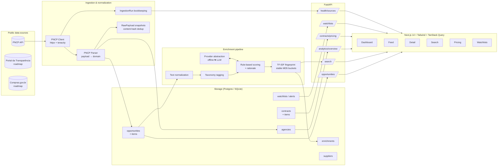

<p align="center">
  
</p>

<h1 align="center">LicitScope</h1>

<p align="center">
  <strong>Explainable procurement intelligence for Brazilian public data.</strong><br/>
  <sub>Live PNCP ingestion · rule-based enrichment · hashed TF-IDF search · pricing anomaly signals</sub>
</p>

<p align="center">
  <a href="https://github.com/george-gioseffi/licitscope/actions/workflows/ci.yml">
    
  </a>
  
  
  
  
  
  
</p>

---

## What it is

LicitScope is a portfolio-grade **govtech intelligence platform** for the
Brazilian public procurement ecosystem. It ingests data from the **Portal
Nacional de Contratações Públicas (PNCP)**, normalizes it into a typed
domain model, enriches every notice with **explainable, rule-based signals**
(summary, keywords, complexity/effort/risk, price anomaly), and ships a
polished Next.js dashboard on top.

Every score, every tag, every similarity ranking comes from code you can
read. There is **no black box and no mandatory LLM call** — the whole
pipeline runs locally, deterministically, and for free. When you want an
LLM-backed summarizer, swap it in via a single `Provider` implementation.

## What it is not

- It is **not** a production SaaS. There's no auth, no multi-tenancy, no
  alert dispatch pipeline (see [ROADMAP](docs/ROADMAP.md)).
- "AI" here means **rule-based NLP + TF-IDF**, not transformers. Calling it
  that upfront is deliberate.
- The bundled `data-demo/` fixtures are **synthetic** — shape-faithful to
  PNCP payloads, but not real records. Point the ingestion service at
  `pncp.gov.br` to get real data.

---

## Screens

The UI is laid out as an intelligence workstation. See
[`docs/SCREENSHOTS.md`](docs/SCREENSHOTS.md) for the walkthrough order.

```
 /                       Dashboard   — KPIs, 30-day publications, modality/state/
                                       category mix, top agencies, source health
 /opportunities          Feed        — faceted filters, sort, paginated grid
 /opportunities/{id}     Detail      — extractive summary, bullet signals,
                                       heuristic scores with per-rule rationale,
                                       items table, similar notices
 /search                 Semantic    — hashed TF-IDF cosine + shared keywords
 /contracts              Pricing     — IQR-based dispersion bars per CATMAT/CATSER,
                                       recent contracts with agency + supplier
 /agencies, /suppliers   Profiles    — KPIs and category mix per entity
 /watchlists             Saved feeds — filters persisted server-side + manual runs
 /health                 Ops         — ingestion-run log per source
 /about                  Meta        — sources, design principles, limits
```

---

## Architecture



See [`docs/ARCHITECTURE.md`](docs/ARCHITECTURE.md) for the full breakdown.

---

## Technical highlights

- **Typed domain end-to-end.** SQLModel at the DB, Pydantic v2 at the API,
  TypeScript at the UI — one shape, three checked surfaces.
- **Replayable ingestion.** Every raw PNCP payload is persisted keyed by a
  SHA-256 content hash before normalization runs, so a parser regression can
  be fixed and re-applied without hitting the live API again.
- **Stable TF-IDF hashing.** Fingerprints are bucketed with MD5 (not
  Python's randomized `hash()`), so similarity stays consistent across
  process restarts.
- **Explainable scoring.** Every rule that fires on complexity / effort /
  risk also emits a short reason; the API returns the rationale under
  `enrichment.entities.score_rationale` and the UI renders it next to the
  score bar.
- **IQR-based anomaly detection.** Pricing dispersion uses a robust
  IQR/median coefficient so a single outlier can't dominate the signal.
- **Facets done properly.** Each facet dimension excludes its own filter
  when counting so users see alternatives, not a tautology.
- **Dual-DB parity.** Same schema compiles on SQLite (tests, local) and
  Postgres (Docker, prod). No Postgres-specific types in the model layer.

---

## Tech stack

| Layer      | Stack                                                                                     |
| ---------- | ----------------------------------------------------------------------------------------- |
| Backend    | FastAPI · SQLModel · Pydantic v2 · httpx · tenacity                                       |
| Data       | PostgreSQL 16 (prod) · SQLite (local/tests) · JSON metadata                               |
| Enrichment | Hand-written rules · hashed TF-IDF similarity · pluggable LLM provider                    |
| Frontend   | Next.js 14 (app router) · TypeScript · Tailwind · TanStack Query · Recharts · lucide      |
| DevOps     | Docker Compose · GitHub Actions · ruff · pytest · ESLint · CodeQL · Dependabot            |
| Tests      | 71 backend tests across parsing, scoring, pricing, filters, ingestion, repos, similarity  |

---

## Quick start

### Docker (recommended)

```bash
git clone https://github.com/george-gioseffi/licitscope && cd licitscope
cp .env.example .env
make up       # postgres + api + web
# http://localhost:3000  (web)   http://localhost:8000/docs  (api)
```

The API container auto-seeds the bundled fixtures on first boot.

### Local (SQLite, no Docker)

```bash
./scripts/dev-setup.sh        # creates venv, installs deps, seeds demo DB
make api &                    # http://localhost:8000
make web                      # http://localhost:3000
```

### Against the live PNCP API

```bash
cd apps/api
INGESTION_USE_FIXTURES=false DATABASE_URL="sqlite:///./licitscope.db" \
    python -m app.scripts.run_ingestion
```

If the live API is unreachable or returns an error, the ingestion service
falls back to the bundled fixtures and marks the run as `partial` with the
reason recorded — the UI always has something to render.

---

## Documentation

| Document                                                 | What it covers                                                             |
| -------------------------------------------------------- | -------------------------------------------------------------------------- |
| [`docs/ARCHITECTURE.md`](docs/ARCHITECTURE.md)           | Service layers, ingestion flow, separation of concerns                     |
| [`docs/DATA_MODEL.md`](docs/DATA_MODEL.md)               | Schema, ERD, constraints, indexes                                          |
| [`docs/INGESTION.md`](docs/INGESTION.md)                 | PNCP endpoints used, rate limits, retry, fallback, raw-payload replay      |
| [`docs/ENRICHMENT.md`](docs/ENRICHMENT.md)               | Rule-based scoring, rationale, similarity, LLM integration surface         |
| [`docs/LOCAL_DEV.md`](docs/LOCAL_DEV.md)                 | Full setup walkthrough, common tasks, environment variables                |
| [`docs/ROADMAP.md`](docs/ROADMAP.md)                     | What is deliberately not built yet + the "next 90 days" shortlist          |
| [`docs/ETHICS.md`](docs/ETHICS.md)                       | Data provenance, responsible use, limitations                              |
| [`docs/SCREENSHOTS.md`](docs/SCREENSHOTS.md)             | Screens to capture for a demo walkthrough                                  |
| [`docs/TALKING_POINTS.md`](docs/TALKING_POINTS.md)       | Interview-ready narratives for the project                                 |

---

## Feature inventory

- [x] PNCP published-notices ingestion with retries, pagination, content-hash
      deduplication, and graceful fixture fallback
- [x] Typed OpenAPI surface — 20+ endpoints documented at `/docs`
- [x] Faceted filters + sort on the opportunities feed (facets show
      alternatives, not tautologies)
- [x] Extractive summary, keyword / date extraction per notice (deterministic)
- [x] Explainable complexity / effort / risk scoring with per-rule rationale
- [x] IQR-based price anomaly detection per CATMAT/CATSER
- [x] Hashed TF-IDF semantic search + nearest-neighbor suggestions
- [x] Agency & supplier profiles with aggregated KPIs
- [x] Server-side watchlists with manual alert runs
- [x] Source-health dashboard with ingestion-run history
- [x] Docker Compose local stack (Postgres + API + web)
- [x] CI: ruff lint + format check, pytest (71), fixture drift guard,
      ESLint, tsc, Next.js build, weekly CodeQL
- [x] Pre-commit hooks + EditorConfig + Dependabot

---

## Roadmap

- [ ] Portal da Transparência and Compras.gov.br integrations
- [ ] pgvector-backed semantic search (keeps offline TF-IDF as fallback)
- [ ] OIDC auth and user-scoped watchlists
- [ ] Scheduled ingestion worker (Celery / cron)
- [ ] Email + webhook alert delivery
- [ ] CSV / Parquet exports
- [ ] LLM-backed summarizer behind the existing `Provider` protocol

Full list in [`docs/ROADMAP.md`](docs/ROADMAP.md).

---

## Disclaimer

LicitScope is an independent portfolio project. It consumes **public**
Brazilian procurement data and does not represent any government agency.
The bundled fixtures under `data-demo/` are **synthetic** (generated with a
seeded PRNG) for demo reliability — treat the pretty numbers in the UI as
shape-faithful illustrations, not as factual records.

## License

MIT — see [LICENSE](LICENSE).
