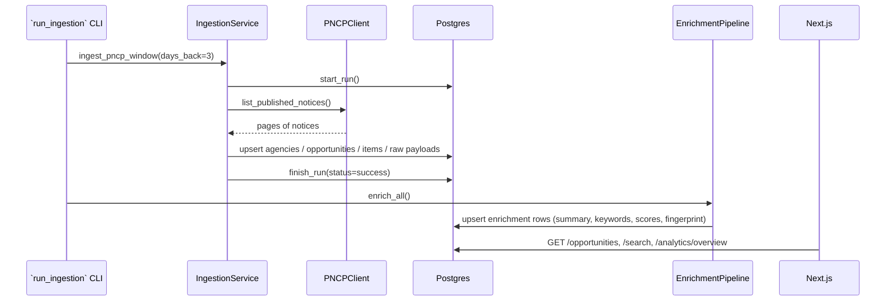

# Architecture

LicitScope is a modular monorepo: three independently-deployable concerns
(ingestion, API, web) share a single database and a single typed domain
model.

```
licitscope/
├── apps/
│   ├── api/            # FastAPI + SQLModel backend (ingestion lives here too)
│   └── web/            # Next.js 14 frontend
├── workers/            # placeholders for future async workers
├── packages/           # shared packages (future)
├── data-demo/          # deterministic fixtures in the shape of real sources
├── docs/               # this folder
├── infra/              # Docker Compose + deployment infra
└── scripts/            # one-shot dev scripts (fixtures, setup)
```

## Why a single process for API + ingestion?

Ingestion is modeled as a **service class** (`app/services/ingestion.py`)
rather than a separate worker binary. That keeps the critical path of the
demo simple (`python -m app.scripts.run_ingestion`), and when you need to
scale you promote the same service class into a Celery/RQ worker without
rewriting the code. The separation happens at the boundary, not at the unit.

## Layer-by-layer

```
                           ┌─────────────────────────┐
 HTTP request ───► FastAPI │ Routers (thin)          │
                           │   - opportunities.py    │
                           │   - search.py …         │
                           └────────────┬────────────┘
                                        ▼
                           ┌─────────────────────────┐
                           │ Services (orchestration)│
                           │   - analytics.py        │
                           │   - ingestion.py        │
                           │   - search.py           │
                           │   - pricing.py          │
                           └────────────┬────────────┘
                                        ▼
                           ┌─────────────────────────┐
                           │ Repositories (SQL)      │
                           │   - opportunities.py …  │
                           └────────────┬────────────┘
                                        ▼
                           ┌─────────────────────────┐
                           │ Models (SQLModel)       │
                           └────────────┬────────────┘
                                        ▼
                                 PostgreSQL / SQLite
```

Each layer has exactly one job. Routers never touch SQL. Services never
build HTTP responses. Repositories never make external calls. This is
worth the little bit of extra file-hopping because it means a new
developer can predict where any given change belongs.

## Enrichment subsystem

```
Opportunity ──► normalize ──► keywords + dates + taxonomy ──► scoring
                                                  │
                                                  ▼
                                        TF-IDF fingerprint (hashed)
                                                  │
                                                  ▼
                                             Enrichment row
```

The enrichment pipeline is deterministic by default (`OfflineProvider`),
meaning you get readable summaries and similarity for free without network
access or paid LLM calls. A `Provider` protocol is in place so that a real
LLM backend can be plugged in via a single env flag (`LLM_PROVIDER`) without
changing call sites.

## Search

Two endpoints back search:

- `GET /search?q=…`         : TF-IDF cosine against the full corpus
- `GET /opportunities/{id}/similar` : TF-IDF cosine against a single notice

The ranker is in-process: every request loads the ~100–1k stored
fingerprints into a `SimilarityIndex` and ranks with a cosine loop. At
larger scale (>10k rows), swap that index with pgvector; the fingerprint
column is already JSON so migration is straightforward.

## Data flow: PNCP → dashboard

1. `IngestionService.ingest_pncp_window` starts an `IngestionRun`.
2. `PNCPClient` fetches pages with retry/backoff.
3. Each payload is hashed and saved as `RawPayload` (idempotent by content
   hash), giving us a replay log for free.
4. `pncp_parser.parse_full` normalizes the payload into `(Agency, Opportunity, Items)`.
5. Repositories upsert by `(source, source_id)` — the canonical cross-source
   key.
6. `EnrichmentPipeline.enrich_all` runs and writes one `Enrichment` row per
   opportunity.
7. Analytics views aggregate directly from the normalized tables.

## Runtime diagram


