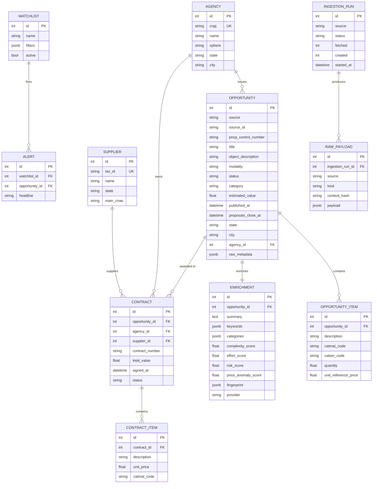

# Data model

LicitScope's schema is intentionally small and normalized. Every SQLModel
class in `apps/api/app/models/` corresponds to one table; relationships
follow the business entities closely so the API surface maps 1:1 to the
model layer.

## Entity-relationship diagram

## Keys, indexes, and why

| Table | Keys / indexes | Reason |
| --- | --- | --- |
| `opportunities` | `UNIQUE (source, source_id)` | Canonical cross-source dedup |
| `opportunities` | index on `published_at`, `proposals_close_at`, `state`, `modality`, `status`, `category`, `agency_id`, `estimated_value` | Backs the faceted feed without scans |
| `agencies` | `UNIQUE cnpj` | Stable lookup from any payload |
| `suppliers` | `UNIQUE tax_id` | Same as above |
| `enrichments` | `UNIQUE opportunity_id` | Exactly one enrichment per notice |
| `raw_payloads` | index on `(source, kind, source_id, content_hash)` | Idempotent payload saves |

## Where the flexibility lives

Three columns deliberately stay JSON:

- `opportunities.raw_metadata` — the untouched source payload. Invaluable
  when a normalization bug slips through.
- `enrichments.fingerprint`    — sparse TF-IDF vector. JSON today; swap with
  `vector` type when enabling pgvector.
- `watchlists.filters`         — mirrors the `OpportunityFilters` Pydantic
  model so the frontend can post the same shape it renders with.

## Portability

Everything compiles against both SQLite (tests, laptop runs) and Postgres
(Docker, production). No Postgres-specific types are used in the schema.
Future pgvector adoption is confined to the fingerprint column; see the
roadmap for the planned migration.
